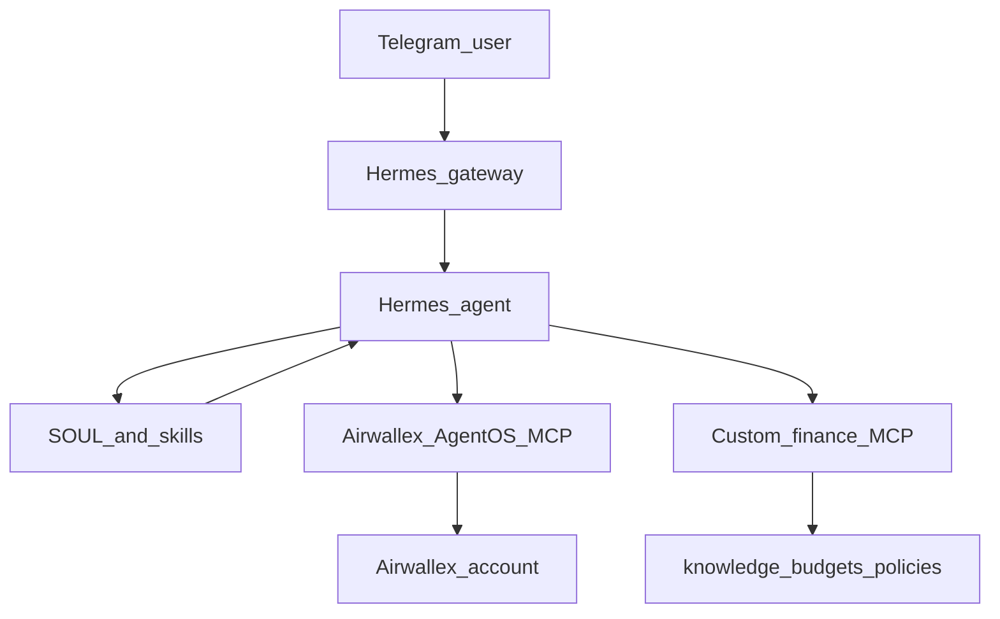

# Repository Guide: Hermes Telegram Finance Manager

This document is the contract for **this repository**: what it contains, how a developer stands up their own agent, and how Hermes uses the pieces after install.

Product thesis, demo storyline, and success criteria live in [airwallex-ai-finance-manager-direction.md](./airwallex-ai-finance-manager-direction.md). Read that for *why* this exists. Read this for *how this repo is structured and used*.

---

## 1. What this repository is

A **setup pack + extension layer** for a self-hosted [Hermes Agent](https://hermes-agent.nousresearch.com/) that talks to you on Telegram and acts as a company finance manager on top of Airwallex.

It is not a hosted bot, not an Airwallex product, and not a proxy in front of Airwallex AgentOS. You clone it, wire it into your own Hermes profile, and run the agent yourself.

The pack has two jobs:

1. **Guide setup** — Hermes, Airwallex AgentOS MCP, Telegram gateway, identity, and allowlists.
2. **Extend the agent** — Hermes skills for persona and workflows, plus a local custom MCP for computed finance tools (runway, anomalies, budget variance, CFO summary).

Airwallex supplies the financial primitives. This repo supplies domain intelligence and the install path.

---

## 2. What you bring

| You provide | Why |
|---|---|
| [Hermes Agent](https://hermes-agent.nousresearch.com/docs/getting-started/installation) installed on a machine that can stay online | Runtime, skills loader, MCP client, Telegram gateway |
| An LLM API key (OpenAI or another Hermes-supported provider) | Reasoning and tool use |
| An Airwallex account with AgentOS access | Live balances, transactions, cards, bills, and other primitives |
| A Telegram bot token from [@BotFather](https://t.me/BotFather) | Channel into the agent |
| Numeric Telegram user IDs to allowlist | Only those people can prompt the finance agent |

Hermes can also speak Discord, Slack, and other gateways. This pack is **Telegram-first**. Use another channel only if you already know Hermes well; the security notes in §7 still apply.

---

## 3. Architecture

```text
Telegram
   ↓
Hermes Agent  (identity, memory, skills, approval behavior)
   ├── Airwallex AgentOS MCP     ← financial primitives (balances, txs, cards, bills)
   ├── This repo's custom MCP    ← computed domain tools (runway, anomalies, variance)
   └── This repo's Hermes skills ← persona, workflows, financial-controls policy
```



### Why AgentOS stays direct

Do **not** insert a proxy:

```text
Hermes → our MCP → Airwallex AgentOS MCP → Airwallex   ← do not build this
```

[Airwallex AgentOS MCP](https://www.airwallex.com/docs/developer-tools/ai/agentos) already exposes production reads and writes to any MCP-compatible agent at `https://mcp.airwallex.com/mcp`. Wrapping it adds a second auth surface and does not make the finance manager smarter.

Hermes should talk to AgentOS the same way it talks to any remote MCP server.

### Why we still ship a second MCP

AgentOS answers “what is the balance?” and “list recent transactions.” It does not encode *your* finance-manager math: months of runway, vendor spikes versus a three-month baseline, budget variance against a local plan file.

That logic belongs in **this repo’s custom MCP**. Those tools compute and compose. They do not re-expose `get_transactions()` or `get_accounts()`.

### Two extension layers

| Layer | Lives in | Teaches / does |
|---|---|---|
| **Skills** | `skills/*/SKILL.md` | *When* and *how* to work: which tools to call, how to phrase answers, when to demand confirmation |
| **Custom MCP** | `mcp/finance-manager/` | *Deterministic tools* the model can call: `get_cash_runway`, `detect_spend_anomalies`, `calculate_budget_variance`, `generate_cfo_summary` |

Skills without tools become essays. Tools without skills become an API dump in Telegram.

### Custom MCP design rule

Tools are **compute-first**.

- Prefer arguments that are already-fetched AgentOS data, or files under `knowledge/`.
- Do not open a second Airwallex API client just to list accounts again.
- Fetch from Airwallex inside a custom tool only if AgentOS cannot express the computation.

---

## 4. Repository map

Layout:

```text
airwallex-finance-manager/
├── README.md                         # short quickstart
├── docs/
│   ├── airwallex-ai-finance-manager-direction.md
│   └── repo-guide.md                 # this document
├── hermes/
│   ├── SOUL.md                       # finance-manager identity
│   ├── config.example.yaml           # mcp_servers + skills.external_dirs
│   └── env.example                   # TELEGRAM_* and model key *names* only
├── skills/
│   ├── finance-manager/SKILL.md
│   ├── cash-position/SKILL.md
│   ├── spend-analysis/SKILL.md
│   ├── anomaly-detection/SKILL.md
│   ├── budget-monitoring/SKILL.md
│   ├── month-end/SKILL.md
│   └── financial-controls/SKILL.md
├── mcp/finance-manager/              # local FastMCP server (Python)
├── knowledge/                        # example budgets, vendors, policies
├── examples/                         # sample Telegram conversations
└── scripts/install.sh                # register skills + both MCP servers
```

Hermes reads from the **home profile** (`~/.hermes/`), not from the git clone, unless you point it here. Example files under `hermes/` are copied or merged into that profile. Skills can stay in the clone if `skills.external_dirs` includes this repo’s `skills/` directory. See [Hermes configuration](https://hermes-agent.nousresearch.com/docs/user-guide/configuration) and [skills](https://hermes-agent.nousresearch.com/docs/user-guide/features/skills).

### `docs/`

Planning and contracts. The direction doc is product intent. This file is the repo contract. Keep them separate.

### `hermes/`

Templates for the user’s Hermes profile:

- `SOUL.md` — finance-manager identity (slot #1 in the Hermes system prompt). `install.sh` copies this over `~/.hermes/SOUL.md` and backs up any previous soul.
- `config.example.yaml` — `mcp_servers` entries for AgentOS (HTTP) and the local finance-manager MCP (stdio), plus `skills.external_dirs`.
- `env.example` — variable *names* only (`TELEGRAM_BOT_TOKEN`, `TELEGRAM_ALLOWED_USERS`, the model provider key). Never commit real tokens.

### `skills/`

One directory per skill, Hermes format: `SKILL.md` required; optional `references/` and `scripts/`. Not loose markdown files.

| Skill | Role |
|---|---|
| `finance-manager` | Persona, tone, what “good” looks like in Telegram |
| `cash-position` | Liquidity questions: total cash, by currency/account, change vs prior period |
| `spend-analysis` | Where money went: month, category, vendor, card, largest txs |
| `anomaly-detection` | What looks weird vs recent baseline |
| `budget-monitoring` | Plan vs actual using `knowledge/` budgets |
| `month-end` | Multi-step close: cash + spend + anomalies + items needing a human |
| `financial-controls` | Always-on approval policy: read / prepare / execute-after-confirm |

### `mcp/finance-manager/`

A local Python MCP server (FastMCP). Hermes launches it as a stdio process from `config.yaml`. Tools:

- `get_cash_runway`
- `detect_spend_anomalies`
- `calculate_budget_variance`
- `generate_cfo_summary`

These combine AgentOS-fetched numbers (and optional `knowledge/` files) into a domain answer. They are not a second Airwallex connector.

### `knowledge/`

Optional company context the custom MCP and skills can read: example budgets, vendor lists, spending policies. Ship examples only. Each operator replaces them with their own files. This is not a full knowledge product in v1 (see §10).

### `examples/`

Sample Telegram threads that show the intended tool sequence, not just the final reply. Useful for verifying a fresh install.

### `scripts/install.sh`

Registers `skills.external_dirs`, merges the MCP blocks into `~/.hermes/config.yaml`, sets `FINANCE_MANAGER_ROOT` in `~/.hermes/.env`, and prints the remaining Telegram / OAuth steps. Run `./scripts/install.sh` from the repo root.

---

## 5. Setup sequence

Official Hermes and Airwallex docs are the source of truth for flags and OAuth UX. This section is the order of operations for *this* pack.

### 5.1 Install Hermes

Follow the [Hermes installation guide](https://hermes-agent.nousresearch.com/docs/getting-started/installation). Confirm `hermes` is on your `PATH` and that `~/.hermes/` exists.

From this repo, `./scripts/install.sh` merges skills, both MCP servers, and `FINANCE_MANAGER_ROOT` into that profile. You still complete OAuth, the model key, and Telegram yourself.

**Local is a full setup.** Install Hermes on your laptop, run `./scripts/install.sh` there, then `hermes mcp login airwallex` — the browser callback hits `127.0.0.1` on the same machine. Use `hermes chat` to try AgentOS and the finance-manager tools without Telegram, or `hermes gateway` for Telegram while the laptop is awake.

Use a VPS only if the Telegram bot must stay online when the laptop sleeps. Remote OAuth is the extra step, not a different product.

### 5.2 Configure the model

Put the provider key in `~/.hermes/.env`. Hermes keeps secrets in `.env` and non-secret settings in `config.yaml`. See [Hermes configuration](https://hermes-agent.nousresearch.com/docs/user-guide/configuration).

Use a frontier model for AgentOS sessions. Weaker models drift off tool-use and safety instructions.

### 5.3 Connect Airwallex AgentOS MCP

This is how the agent knows **your** account. There is no `AIRWALLEX_API_KEY` in `env.example` and you should not paste Airwallex secrets into this repo.

AgentOS MCP is a remote HTTP server:

- Production endpoint: `https://mcp.airwallex.com/mcp`
- Auth: OAuth against the Airwallex account you sign in with in the browser
- Money-out actions are off by default on AgentOS itself

`./scripts/install.sh` only writes the server block (`url` + `auth: oauth`). That does **not** log you in. From a fresh terminal (not from inside a running Hermes session):

```bash
hermes mcp login airwallex
```

Hermes opens (or prints) an authorize URL. Sign in to the Airwallex org whose balances you want the bot to see, grant the scopes you are willing to give the agent, and return. Tokens are cached at `~/.hermes/mcp-tokens/` and reused until refresh fails. Re-run `hermes mcp login airwallex` to switch accounts or re-authorize.

#### Remote server / VPS

The Telegram gateway is meant to stay online, so Hermes often lives on a VPS. OAuth still runs **on that machine**. Your laptop is only the browser.

1. SSH in as the **same Unix user** that will run `hermes gateway` (tokens land in *that* user’s `~/.hermes/mcp-tokens/`).
2. From a fresh terminal on the server (not inside a running Hermes session):

   ```bash
   hermes mcp login airwallex
   ```

3. Hermes prints an authorize URL and listens on `127.0.0.1` on the server. Open that URL on your **laptop**.
4. After you approve, the browser redirects to `http://127.0.0.1:<port>/callback`. That page will fail to load — expected, because the listener is on the server, not your laptop.
5. Copy the **full** URL from the address bar (it contains `code=` and `state=`) and paste it at the Hermes prompt. A bare `?code=...&state=...` also works.

That paste-back path is the one to use first. SSH port-forwarding is optional; see [OAuth over SSH](https://hermes-agent.nousresearch.com/docs/guides/oauth-over-ssh).

Do not start this by editing `config.yaml` inside an already-running session — Hermes’ auto-reload only waits ~30s, which is too short for a browser login. `hermes mcp login` waits minutes.

If you added the block by hand instead of install.sh, use `hermes mcp add` or this shape (see [Hermes MCP](https://hermes-agent.nousresearch.com/docs/user-guide/features/mcp) and [MCP config reference](https://hermes-agent.nousresearch.com/docs/reference/mcp-config-reference)):

```yaml
mcp_servers:
  airwallex:
    url: "https://mcp.airwallex.com/mcp"
    auth: oauth
    enabled: true
```

#### Sandbox (Developer MCP)

There is no sandbox clone of AgentOS MCP. Production finance ops stay at `https://mcp.airwallex.com/mcp`. Sandbox is a **different server**: [Developer MCP](https://www.airwallex.com/docs/developer-tools/ai/developer-connector) — docs, simulate-event tools, and some sandbox endpoints. It never sees your live account. Tool names will not match AgentOS 1:1, so cash-position / month-end skills may need you to adapt prompts.

You need an [Airwallex sandbox](https://demo.airwallex.com/) account.

In `~/.hermes/config.yaml`, either **replace** the production URL (then re-login) or add a second server and turn production off:

```yaml
mcp_servers:
  airwallex:
    enabled: false          # leave false while you are on sandbox
    url: "https://mcp.airwallex.com/mcp"
    auth: oauth
  airwallex-sandbox:
    url: "https://mcp.sandbox.airwallex.com/developer"
    auth: oauth
    enabled: true
```

Then, from a fresh terminal:

```bash
hermes mcp login airwallex-sandbox
```

Sign in to the **sandbox** org, not production. Tokens are per server name under `~/.hermes/mcp-tokens/`. A production token will not work against the sandbox URL.

If you instead change `airwallex.url` in place, you must run `hermes mcp login airwallex` again after the URL change.

Docs: [Airwallex AgentOS](https://www.airwallex.com/docs/developer-tools/ai/agentos), [Developer connectors](https://www.airwallex.com/docs/developer-tools/ai/developer-connector).

### 5.4 Point Hermes at this repo’s skills

Do not rely on Hermes inventing the finance-manager persona. Attach this repo’s `skills/` directory.

In `~/.hermes/config.yaml` ([skills system](https://hermes-agent.nousresearch.com/docs/user-guide/features/skills)):

```yaml
skills:
  external_dirs:
    - /absolute/path/to/airwallex-finance-manager/skills
```

Alternatively, copy the skill folders into `~/.hermes/skills/`. External dirs keep updates in git; a copy is simpler if you do not want Hermes writing back into the clone.

Copy or merge `hermes/SOUL.md` into `~/.hermes/SOUL.md` so the agent introduces itself as a finance manager, not a generic coding assistant.

Hermes seeds its own default `SOUL.md` on first install (“You are Hermes Agent…”). `./scripts/install.sh` **replaces** `~/.hermes/SOUL.md` with this repo’s finance-manager soul and keeps the previous file at `~/.hermes/SOUL.pre-finance-manager.md`. Start a **new** session after install. Restarting `hermes gateway` is not enough — Telegram restores the previous DM. In that chat send `/new` (or `/reset`) so SOUL.md is loaded. Skills are not dumped into every greeting — they load when the question matches (cash, spend, anomalies, close).

### 5.5 Register the local finance-manager MCP

`./scripts/install.sh` registers this for you. To do it by hand, add a **stdio** server (a `command`, not a `url`):

```yaml
mcp_servers:
  airwallex:
    url: "https://mcp.airwallex.com/mcp"
    auth: oauth
    enabled: true
  finance-manager:
    command: "uv"
    args: ["run", "--directory", "/absolute/path/to/airwallex-finance-manager/mcp/finance-manager", "python", "-m", "finance_manager"]
    enabled: true
```

Exact `command` / `args` are in [`mcp/finance-manager/README.md`](../mcp/finance-manager/README.md). After editing, reload MCP in the Hermes session (`/reload-mcp` or restart the gateway). Hermes will prefix tools as `mcp__finance_manager__<tool>` so they do not collide with AgentOS names. See [Use MCP with Hermes](https://hermes-agent.nousresearch.com/docs/guides/use-mcp-with-hermes).

### 5.6 Connect Telegram

1. Create a bot with [@BotFather](https://t.me/BotFather). Save the token; do not commit it.
2. Get your numeric user ID (for example via [@userinfobot](https://t.me/userinfobot)).
3. Prefer the wizard:

   ```bash
   hermes gateway setup
   ```

   Select Telegram, paste the token, and add allowed user IDs.

   Or set in `~/.hermes/.env`:

   ```bash
   TELEGRAM_BOT_TOKEN=
   TELEGRAM_ALLOWED_USERS=
   ```

   `TELEGRAM_ALLOWED_USERS` is a comma-separated list of numeric IDs.

4. Start the gateway:

   ```bash
   hermes gateway
   ```

   For something that survives logout, use `hermes gateway install` as described in the [Telegram](https://hermes-agent.nousresearch.com/docs/user-guide/messaging/telegram) and [messaging gateway](https://hermes-agent.nousresearch.com/docs/user-guide/messaging/) docs.

5. Send the bot a private message. Confirm it answers before you add anyone else.

---

## 6. How the agent uses each layer

After setup, a Telegram message does not “run the repo.” Hermes is already running. The repo is loaded as identity, skills, and MCP tool servers.

**Skills** decide the workflow. **AgentOS** fetches or prepares Airwallex resources. **Custom MCP** computes derived numbers. **`financial-controls`** decides whether the agent may only read, may prepare, or must stop and ask.

### Layer cheat sheet

| User asks… | Skill that should load | AgentOS (primitives) | Custom MCP (computed) |
|---|---|---|---|
| “How much cash / runway?” | `cash-position` | Balances, accounts, recent activity | `get_cash_runway` |
| “What did we spend the most on?” | `spend-analysis` | Transactions, cards, expenses | Optional summary helpers |
| “Anything weird?” | `anomaly-detection` | Transactions, vendors, cards | `detect_spend_anomalies` |
| “Are we over budget?” | `budget-monitoring` | Spend-to-date | `calculate_budget_variance` against `knowledge/` |
| “Prepare the month-end pack” | `month-end` | Cash, expenses, bills | `generate_cfo_summary` plus the tools above |
| “Pay this invoice” | `financial-controls` | Prepare payment / beneficiary | None — no custom tool moves money |

### Walkthrough: “How much runway do we have?”

1. Telegram message hits the Hermes gateway.
2. `cash-position` (and the finance-manager persona) load.
3. The agent calls AgentOS for current balances and enough recent outflow to estimate burn. It does **not** invent a balance from memory.
4. It calls `get_cash_runway` with those figures (or asks the tool to read whatever compute-first contract we ship).
5. The reply is a short liquidity summary: total cash, by currency if useful, months of runway, and one caveat if the burn window is thin. Not a raw JSON dump.

### Walkthrough: “Anything weird this month?”

1. `anomaly-detection` loads.
2. AgentOS supplies recent transactions and, if available, card / vendor breakdowns.
3. `detect_spend_anomalies` compares against a baseline (prior months, or rules in `knowledge/`).
4. The agent lists a few specific findings (new vendor, spike, outlier card) with amounts and why they flagged — then stops unless you ask it to dig in.

### Walkthrough: “Pay this invoice.”

1. `financial-controls` loads and pins the session to **prepare, do not execute**.
2. AgentOS may create or draft the payment / beneficiary. AgentOS itself does not initiate money-out by default.
3. The custom MCP is not used to send money.
4. The agent replies in Telegram with what it prepared and asks for an explicit yes from an allowlisted user before any execute-level step.
5. If you say no, it leaves the draft and does not retry quietly.

### What the agent must never do

- Invent balances, transactions, or “I think we have about…”
- Treat a previous chat’s numbers as current without a fresh AgentOS read
- Call a custom tool that only exists to wrap `get_accounts`
- Execute a money-out action because a skill “usually does that”

---

## 7. Telegram-specific controls

Telegram is a chat surface with your Airwallex scopes behind it. Treat it like handing someone the Airwallex web app.

- **Allowlist only.** Set `TELEGRAM_ALLOWED_USERS` to numeric IDs you know. Do not enable open pairing on a bot that has AgentOS connected.
- **Private DMs first.** Prove the token, profile, and MCP servers in a 1:1 chat before any group.
- **Do not put this bot in a public or loosely-managed group.** Airwallex’s AgentOS guidance is explicit: anyone who can prompt the agent may perform actions with your OAuth scopes that they cannot perform in the Airwallex apps. That includes Telegram groups.
- **Approval UX is a Telegram message.** “I prepared payment X for Y. Reply YES to submit” — not a hidden auto-approve flag.
- **One bot per environment.** Sandbox experiments and production finance should not share a token or a Hermes profile.

Hermes Telegram setup details: [Telegram user guide](https://hermes-agent.nousresearch.com/docs/user-guide/messaging/telegram).

---

## 8. Security ladder

Start read-only. Climb only when the skill, the MCP, and the human agree.

| Level | Allowed | Owner of the gate |
|---|---|---|
| **1 — Read** | Balances, accounts, transactions, cards, expenses, bills, reports | AgentOS OAuth scopes + `cash-position` / `spend-analysis` / `anomaly-detection` |
| **2 — Prepare** | Draft payment, reimbursement, transfer, card request | AgentOS write tools (annotated for confirmation) + `financial-controls` |
| **3 — Execute** | Sensitive money-out or irreversible account change | Explicit Telegram confirmation from an allowlisted user. AgentOS default is still no autonomous money-out. |

Mapping:

- **AgentOS** is the primitive gate (scopes, no money-out by default, write-tool annotations).
- **`financial-controls`** is the *behavior* gate (the model must ask, must not skip confirmation, must not invent a “you already approved”).
- **Custom MCP** has no execute-level money tools. If a tool cannot be justified as compute or summary, it does not belong there.
- **Credentials** stay in `~/.hermes/.env` and the AgentOS OAuth session. They are never pastable into a prompt and never stored in this git repo.

Never let the model be the source of financial truth. For account-specific answers, retrieve current data.

Further AgentOS safety notes: [Airwallex AgentOS — Safety and responsibility](https://www.airwallex.com/docs/developer-tools/ai/agentos).

---

## 9. Extension points

Keep AgentOS as the primitive layer. Add intelligence here, not another Airwallex wrapper.

**Add a skill.** Create `skills/<name>/SKILL.md` in Hermes’ [skill format](https://hermes-agent.nousresearch.com/docs/developer-guide/creating-skills). Point at existing AgentOS tools and custom MCP tools. Reload or restart Hermes.

**Add a custom tool.** Implement a compute-first function on the finance-manager MCP (for example `forecast_cash_13_week`). Update the skill that should call it. Do not add `list_transactions` “for convenience.”

**Add a knowledge file.** Drop a budget, vendor list, or policy under `knowledge/` and teach one skill (or one tool) to read it. Example files in the repo stay generic.

**Tighten MCP visibility.** Use Hermes `tools.include` / `tools.exclude` on the `airwallex` server if you want Telegram to see only read tools during Level 1.

**Optional later connectors.** Airwallex CLI (terminal, broadest API coverage) and Developer MCP (sandbox + docs) are compatible with Hermes but are not required for the Telegram finance manager path.

---

## 10. Out of scope for v1

These belong in later phases; do not block the setup pack on them. Details and motivation: direction doc §§13–14.

- **Proactive monitoring** — Airwallex webhooks, an event processor, and unsolicited Telegram alerts (“AWS is up 31%”). v1 is request/response.
- **Full company-knowledge product** — contract store, department ownership graph, live policy engine. v1 is optional files in `knowledge/`.
- **Hosted Hermes / multi-tenant SaaS** — every operator runs their own agent and their own Airwallex OAuth.
- **An AgentOS proxy or re-implemented Airwallex API client** as the primary data plane.

---

## Related docs

| Doc | Role |
|---|---|
| [airwallex-ai-finance-manager-direction.md](./airwallex-ai-finance-manager-direction.md) | Why this project exists, demo scenes, phases, success criteria |
| [Hermes installation](https://hermes-agent.nousresearch.com/docs/getting-started/installation) | Install the agent runtime |
| [Hermes Telegram](https://hermes-agent.nousresearch.com/docs/user-guide/messaging/telegram) | BotFather, allowlists, gateway |
| [Hermes MCP](https://hermes-agent.nousresearch.com/docs/user-guide/features/mcp) | Register AgentOS + the local server |
| [Hermes skills](https://hermes-agent.nousresearch.com/docs/user-guide/features/skills) | `SKILL.md` and `external_dirs` |
| [Airwallex AgentOS](https://www.airwallex.com/docs/developer-tools/ai/agentos) | Production MCP, OAuth, skills, safety |
